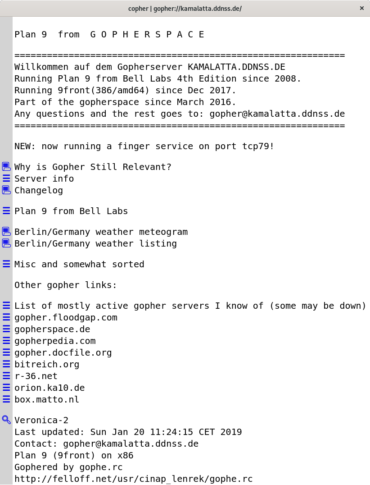

# copher

**copher** is a desktop GUI [gopher][] client powered by [carlo][].

## Usage

> **Note:** Chrome or Chromium must be installed.

Install with npm:

    $ npm i -g copher

Then run, optionally passing in a gopher URL (defaults to
`gopher://gopher.floodgap.com`):

    $ copher [url]

Alternatively, use npx:

    $ npx copher [url]

To navigate, click on the blue links on the left. You can go back and forward by
using the left and right arrow keys.

HTML/web links and Telnet links will open in the system default
applications. Images will open as a new page in copher.

## Known Issues

There is a bug that causes a "back" (via left arrow key) to navigate from the
initial page to a blank page lacking the ability to move forward again. This is
fixed by using Chrome Canary. You can specify which Chrome binary to use by
setting the `CHROME_PATH` environment variable.

## License

The MIT License. See LICENSE.txt.

[gopher]: https://en.wikipedia.org/wiki/Gopher_(protocol)
[carlo]: https://github.com/GoogleChromeLabs/carlo
